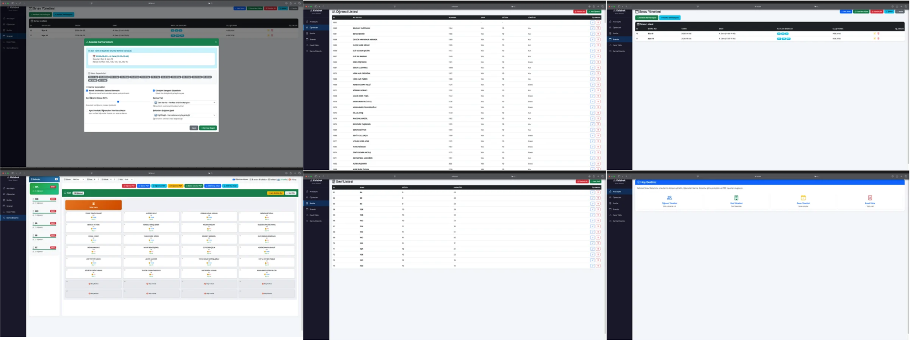

<div align="center">

# 🦋 Kelebek Sınav Sistemi

### Okullar için Açık Kaynaklı Sınav Karma ve Oturma Planı Yönetim Sistemi

[](https://www.python.org/)
[](https://flask.palletsprojects.com/)
[](https://www.sqlite.org/)
[](https://getbootstrap.com/)
[](LICENSE)

[](https://github.com/mdaedalus/sinav-karma-sistemi/stargazers)
[](https://github.com/mdaedalus/sinav-karma-sistemi/network)
[](https://github.com/mdaedalus/sinav-karma-sistemi/issues)

**Kelebek Sınav Sistemi**, okullarda sınav organizasyonunu kolaylaştırmak için geliştirilmiş, tamamen ücretsiz ve açık kaynaklı bir web uygulamasıdır. Öğrencileri otomatik olarak salonlara dağıtır, aynı sınıftan öğrencilerin yan yana gelmemesini sağlar ve profesyonel PDF raporları oluşturur.

[Özellikler](#-özellikler) • [Kurulum](#-kurulum) • [Kullanım](#-kullanım) • [Ekran Görüntüleri](#-ekran-görüntüleri) • [Destek](#-okullar-için-ücretsiz-destek) • [Katkı](#-katkıda-bulunma)

</div>

---

## 📖 İçindekiler

- [Neden Kelebek?](#-neden-kelebek)
- [Özellikler](#-özellikler)
- [Ekran Görüntüleri](#-ekran-görüntüleri)
- [Kurulum](#-kurulum)
  - [Gereksinimler](#gereksinimler)
  - [Windows Kurulumu](#windows-kurulumu)
  - [Linux / macOS Kurulumu](#linux--macos-kurulumu)
  - [Docker ile Kurulum](#docker-ile-kurulum)
- [Kullanım](#-kullanım)
  - [1. Sınıf ve Öğrenci Verisi Yükleme](#1-sınıf-ve-öğrenci-verisi-yükleme)
  - [2. Sınav Oluşturma](#2-sınav-oluşturma)
  - [3. Kelebek Karma Başlatma](#3-kelebek-karma-başlatma)
  - [4. PDF Raporları](#4-pdf-raporları)
- [Excel Formatı](#-excel-formatı)
- [Karma Algoritması](#-karma-algoritması)
- [Teknoloji Yığını](#️-teknoloji-yığını)
- [Proje Yapısı](#-proje-yapısı)
- [Okullar İçin Ücretsiz Destek](#-okullar-için-ücretsiz-destek)
- [Katkıda Bulunma](#-katkıda-bulunma)
- [Lisans](#-lisans)
- [İletişim](#-iletişim)

---

## 🎯 Neden Kelebek?

Sınav organizasyonu okullarda her dönem tekrarlanan, zaman alıcı ve hata yapmaya açık bir süreçtir. **Kelebek Sınav Sistemi** bu süreci dakikalar içinde otomatikleştirir:

| Geleneksel Yöntem | Kelebek Sınav Sistemi |
|-------------------|----------------------|
| ❌ Elle salon listesi hazırlama (saatler) | ✅ Otomatik dağıtım (saniyeler) |
| ❌ Aynı sınıftan öğrenciler yan yana | ✅ Akıllı karma algoritması |
| ❌ Excel'de manuel düzenleme | ✅ Excel'den toplu yükleme |
| ❌ Word'de tek tek liste hazırlama | ✅ Otomatik PDF raporları |
| ❌ Sürpriz hatalar | ✅ Kontrollü simülasyon |

**Kelebek**, öğretmenlerin ve idarecilerin değerli zamanını kurtarır, sınav güvenliğini artırır.

---

## ✨ Özellikler

### 📊 Veri Yönetimi
- ✅ **Öğrenci Yönetimi** - Ekle, düzenle, sil
- ✅ **Sınıf Yönetimi** - Sınıf tanımları ve kapasiteler
- ✅ **Excel'den Toplu Yükleme** - Tek tıkla yüzlerce öğrenci
- ✅ **Otomatik Veri Doğrulama** - Hatalı satırları atlar, raporlar

### 🎯 Sınav Yönetimi
- ✅ **Sınav Oluşturma** - Tarih, saat, sınıf seçimi
- ✅ **Çakışma Kontrolü** - Aynı sınav tekrarını engeller
- ✅ **Çoklu Sınıf Desteği** - Aynı anda birden fazla sınıf
- ✅ **PDF Yükleme** - Sınav kağıtlarını sisteme ekle

### 🔀 Kelebek Karma Algoritması
- ✅ **Tam Karma** - Herkes birbirine karışır
- ✅ **Sınıf Bazlı** - Sınıflar kendi içinde karışır
- ✅ **Dengeli Karma** - Cinsiyet ve sınıf dengesi
- ✅ **Akıllı Dağıtım** - Aynı sınıftan yan yana gelmez
- ✅ **Simülasyon Modu** - Kaydetmeden önizleme
- ✅ **Eşit / Doldur / Rastgele** dağıtım yöntemleri

### 🖨️ PDF Raporları
- ✅ **Öğrenci PDF** - Her sınıfın sınav programı
- ✅ **İdareci PDF** - Genel dağılım istatistikleri
- ✅ **Öğretmen PDF** - Kağıt dağıtım listesi
- ✅ **Gözetmen PDF** - Salon sıra düzeni
- ✅ **Salon PDF** - Salon bazlı oturma planı
- ✅ **Türkçe Karakter Desteği** - ı, ş, ğ, ü, ö, ç

### 🎨 Oturma Planı Editörü
- ✅ **Sürükle-Bırak** - Öğrenci yerlerini manuel değiştir
- ✅ **Tekli / Çiftli / Sınıf Düzeni** - Farklı sıra tipleri
- ✅ **Yılan / Sıralı / Ters** - Oturma sırası
- ✅ **Aynı Sınıfları Ayır** - Tek tıkla karıştır
- ✅ **JSON İçe/Dışa Aktar** - Planı kaydet ve paylaş

---

## 📸 Ekran Görüntüleri


<div align="center">

### Ana Sayfa



</div>

---

## 🚀 Kurulum

### Gereksinimler

| Yazılım | Minimum Sürüm | İndirme |
|---------|---------------|---------|
| **Python** | 3.9+ | [python.org](https://www.python.org/downloads/) |
| **pip** | 20.0+ | Python ile birlikte gelir |
| **Git** | 2.30+ | [git-scm.com](https://git-scm.com/) |

**İşletim Sistemi:** Windows 10+, Ubuntu 20.04+, macOS 11+

---

### Windows Kurulumu

#### 1️⃣ Python'u Kurun

[python.org](https://www.python.org/downloads/) adresinden Python 3.9+ indirin ve kurarken **"Add Python to PATH"** seçeneğini işaretleyin.

#### 2️⃣ Projeyi İndirin

```cmd
git clone https://github.com/mdaedalus/sinav-karma-sistemi.git
cd sinav-karma-sistemi
```

Alternatif: [ZIP olarak indir](https://github.com/mdaedalus/sinav-karma-sistemi/archive/refs/heads/main.zip) ve çıkartın.

#### 3️⃣ Sanal Ortam Oluşturun

```cmd
python -m venv venv
venv\Scripts\activate
```

#### 4️⃣ Bağımlılıkları Yükleyin

```cmd
pip install -r requirements.txt
```

#### 5️⃣ Uygulamayı Başlatın

```cmd
python app.py
```

#### 6️⃣ Tarayıcıda Açın

```
http://localhost:5000
```

---

### Linux / macOS Kurulumu

```bash
# 1. Projeyi klonlayın
git clone https://github.com/mdaedalus/sinav-karma-sistemi.git
cd sinav-karma-sistemi

# 2. Sanal ortam oluşturun
python3 -m venv venv
source venv/bin/activate

# 3. Bağımlılıkları yükleyin
pip install -r requirements.txt

# 4. Uygulamayı başlatın
python app.py
```

Tarayıcıda açın: `http://localhost:5000`

---

### Docker ile Kurulum

`Dockerfile`:

```dockerfile
FROM python:3.11-slim

WORKDIR /app

# Sistem bağımlılıkları (PDF için fontlar)
RUN apt-get update && apt-get install -y \
    fonts-dejavu \
    && rm -rf /var/lib/apt/lists/*

COPY requirements.txt .
RUN pip install --no-cache-dir -r requirements.txt

COPY . .

RUN mkdir -p uploads/exam_pdfs

EXPOSE 5000

CMD ["python", "app.py"]
```

`docker-compose.yml`:

```yaml
version: '3.8'

services:
  kelebek:
    build: .
    container_name: kelebek-sinav
    ports:
      - "5000:5000"
    volumes:
      - ./database.db:/app/database.db
      - ./uploads:/app/uploads
    restart: unless-stopped
```

Çalıştırma:

```bash
docker-compose up -d
```

---

## 📚 Kullanım

### 1. Sınıf ve Öğrenci Verisi Yükleme

**Yöntem A: Excel ile Toplu Yükleme (Önerilen)**

1. `/upload` sayfasına gidin
2. Excel dosyanızı hazırlayın (aşağıdaki formatta)
3. Yükleyin ve veritabanı otomatik güncellenir

**Yöntem B: Manuel Giriş**

1. `/classes` → Tek tek sınıf ekleyin
2. `/students` → Tek tek öğrenci ekleyin

---

### 2. Sınav Oluşturma

1. `/exams` sayfasına gidin
2. **"Yeni Sınav"** butonuna tıklayın
3. Bilgileri doldurun:
   - Sınav adı: `Matematik 1. Yazılı`
   - Tarih: `2026-05-09`
   - Ders saati: `2. Ders (09:20-10:00)`
   - Sınıflar: `9A, 9B, 9C` (checkbox ile seçin)
4. **"Kaydet"** butonuna basın

> 💡 **İpucu:** Excel'den toplu sınav yüklemek için **"Excel'den Yükle"** butonunu kullanın.

---

### 3. Kelebek Karma Başlatma

1. `/exams` sayfasında **"Kelebek Karma Başlat"** butonuna tıklayın
2. Karma seçeneklerini belirleyin:
   - **Karma Tipi:** Tam / Sınıf Bazlı / Dengeli
   - **Dağıtım:** Eşit / Doldur / Rastgele
   - **Cinsiyet Dengesi:** Açık / Kapalı
3. **"Simülasyon Yap"** ile önizleyin
4. Memnunsanız **"Karmayı Başlat"** butonuna basın

Sistem otomatik olarak:
- ✅ Aynı sınıftan öğrencileri ayırır
- ✅ Kendi sınıfındaki salona yerleştirmez
- ✅ Kapasiteyi aşmaz
- ✅ Cinsiyet dengesini gözetir

---

### 4. PDF Raporları

Karma tamamlandıktan sonra `/mix-editor` sayfasından PDF oluşturabilirsiniz:

| Buton | Açıklama |
|-------|----------|
| 📄 **Öğrenci PDF** | Her öğrencinin sınav programı |
| 📊 **İdareci PDF** | Genel istatistikler ve dağılım |
| 📝 **Öğretmen PDF** | Kağıt dağıtım listesi |
| 🎯 **Gözetmen PDF** | Salon sıra düzeni |
| 🏫 **Salon PDF** | Salon bazlı oturma planı |

---

## 📊 Excel Formatı

### Sınıf ve Öğrenci Yükleme (`/upload` sayfası)

Excel dosyanızda **2 sayfa (sheet)** olmalı:

#### 📄 `classes` sayfası:

| Sınıf | Düzey | Kapasite |
|-------|-------|----------|
| 9A | 9 | 30 |
| 9B | 9 | 30 |
| 10A | 10 | 25 |

#### 📄 `students` sayfası:

| Ad | Soyad | Numara | Sınıf | Düzey | Cinsiyet |
|-----|-------|--------|-------|-------|----------|
| Ahmet | Yılmaz | 901 | 9A | 9 | Erkek |
| Ayşe | Demir | 902 | 9A | 9 | Kız |

> ⚠️ **Önemli:** Numara alanı benzersiz olmalıdır.

---

### Sınav Yükleme (`/exams` → "Excel'den Yükle")

Tek sayfalık Excel:

| Ders | Tarih | Saat | Düzey | Sınıflar |
|------|-------|------|-------|----------|
| Matematik | 2026-05-09 | 2 | 9 | A,B,C |
| Türkçe | 2026-05-09 | 3 | 9 | A,B |
| Fizik | 2026-05-10 | 1 | 10 | A,B |

> 💡 **İpucu:** "A,B,C" yazarsanız sistem otomatik olarak "9A,9B,9C" oluşturur.

---

## 🧠 Karma Algoritması

Kelebek, öğrencileri yerleştirirken şu kuralları gözetir:

```
1. Öğrenci kendi sınıfının bulunduğu salona yerleştirilmez.
2. Aynı sınıftan öğrenciler mümkün olduğunca ayrı sıralara yerleştirilir.
3. Cinsiyet dengesi gözetilir (kız-erkek dönüşümlü).
4. Salon kapasiteleri aşılmaz.
5. Aynı sınav grubundaki (tarih+saat) tüm sınıflar birlikte işlenir.
```

### Karma Tipleri

| Tip | Açıklama |
|-----|----------|
| **Tam Karma** | Tüm öğrenciler rastgele karıştırılır |
| **Sınıf Bazlı** | Her sınıf kendi içinde karıştırılır |
| **Dengeli** | Cinsiyet ve sınıf dengesi maksimum gözetilir |

### Dağıtım Yöntemleri

| Yöntem | Açıklama |
|--------|----------|
| **Eşit** | Her salona sırayla yerleştirir |
| **Doldur** | Bir salonu doldurup diğerine geçer |
| **Rastgele** | Rastgele salon seçer |

---

## 🛠️ Teknoloji Yığını

### Backend
- 🐍 **Python 3.9+** - Ana dil
- 🌶️ **Flask 3.0** - Web framework
- 🗄️ **SQLite 3** - Veritabanı
- 🐼 **Pandas** - Excel okuma
- 📄 **ReportLab** - PDF oluşturma

### Frontend
- 🎨 **Bootstrap 5.3** - UI framework
- 🎯 **Bootstrap Icons** - İkonlar
- ⚡ **Vanilla JavaScript** - Etkileşim
- 📑 **jsPDF + html2canvas** - Client-side PDF
- 📖 **PDF.js** - PDF önizleme

---

## 📁 Proje Yapısı

```
sinav-karma-sistemi/
│
├── app.py                      # Ana Flask uygulaması
├── requirements.txt            # Python bağımlılıkları
├── database.db                 # SQLite veritabanı (otomatik oluşur)
├── LICENSE                     # MIT lisansı
├── README.md                   # Bu dosya
├── .gitignore                  # Git ignore kuralları
├── Dockerfile                  # Docker yapılandırması
├── docker-compose.yml          # Docker Compose yapılandırması
│
├── templates/                  # HTML şablonları
│   ├── base.html               # Ana şablon (sidebar, footer)
│   ├── index.html              # Ana sayfa
│   ├── students.html           # Öğrenci yönetimi
│   ├── classes.html            # Sınıf yönetimi
│   ├── exams.html              # Sınav yönetimi
│   ├── upload.html             # Excel yükleme
│   └── mix_editor.html         # Karma düzenleyici
│
├── static/                     # Statik dosyalar
│   ├── css/
│   │   └── style.css           # Özel CSS
│   └── js/
│       ├── exams.js            # Sınav işlemleri
│       ├── mix_editor.js       # Karma editör
│       ├── students.js         # Öğrenci işlemleri
│       ├── classes.js          # Sınıf işlemleri
│       └── upload.js           # Excel yükleme
│
├── uploads/                    # Yüklenen dosyalar (otomatik)
│   └── exam_pdfs/              # Sınav PDF'leri
│
└── docs/                       # Dokümantasyon
    └── screenshots/            # Ekran görüntüleri
```

---

## 🎓 Okullar İçin Ücretsiz Destek

<div align="center">

### 🏫 Eğitim Kurumlarına Özel Destek

**Kelebek Sınav Sistemi**, tüm okullar için **tamamen ücretsizdir**.

</div>

### ✅ Neler Sağlıyoruz?

| Hizmet | Açıklama | Ücret |
|--------|----------|-------|
| 📦 **Yazılım Kullanımı** | Sınırsız kullanım, sınırsız öğrenci | **Ücretsiz** |
| 🔧 **Uzaktan Kurulum** | Okulunuzun sunucusuna kurulum | **Ücretsiz** |
| 🎓 **Eğitim Desteği** | Öğretmen ve idarecilere kullanım eğitimi | **Ücretsiz** |
| 🐛 **Hata Desteği** | Karşılaşılan sorunlarda teknik destek | **Ücretsiz** |
| 🎨 **Özelleştirme Danışmanlığı** | Okulunuza özel ihtiyaçlar için yönlendirme | **Ücretsiz** |
| 📊 **Excel Şablonları** | Okulunuza özel Excel şablonları | **Ücretsiz** |

### 📧 Nasıl Talep Ederim?

Kurulum veya destek talebi için:

**📧 E-posta:** [eminnesatg@gmail.com](mailto:eminnesatg@gmail.com)

**Konu başlığı örnekleri:**
- `Kurulum Talebi - [Okul Adı]`
- `Destek Talebi - [Okul Adı]`
- `Eğitim Talebi - [Okul Adı]`

**E-postada belirtmeniz gerekenler:**
- Okul adı ve ili
- Kurulum yapılacak sunucu/bilgisayar bilgisi (Windows / Linux)
- Öğrenci sayısı (yaklaşık)
- Varsa özel ihtiyaçlarınız

En kısa sürede geri dönüş yapılacaktır. 🚀

---

## 🤝 Katkıda Bulunma

Katkılarınız bizim için değerlidir! Kelebek'i daha iyi hale getirmek için:

### 1. Fork'layın ve Klonlayın

```bash
git clone https://github.com/mdaedalus/sinav-karma-sistemi.git
cd sinav-karma-sistemi
```

### 2. Yeni Branch Oluşturun

```bash
git checkout -b ozellik/yeni-ozellik-adi
```

### 3. Değişikliklerinizi Yapın

- Kod stiline uyun (PEP 8)
- Türkçe yorum satırları ekleyin
- Test edin

### 4. Commit Edin

```bash
git commit -m "✨ Yeni özellik: XYZ eklendi"
```

**Commit mesajı formatı:**
- `✨ feat:` Yeni özellik
- `🐛 fix:` Hata düzeltme
- `📝 docs:` Dokümantasyon
- `🎨 style:` Tasarım
- `♻️ refactor:` Kod yenileme

### 5. Push ve Pull Request

```bash
git push origin ozellik/yeni-ozellik-adi
```

GitHub'da **Pull Request** açın.

---

## 🐛 Hata Bildirimi

Hata bulduysanız [Issues](https://github.com/mdaedalus/sinav-karma-sistemi/issues) bölümünden bildirin:

- **Ne oldu?** Detaylı açıklama
- **Ne bekliyordunuz?** Beklenen davranış
- **Nasıl tekrar üretilir?** Adım adım
- **Ekran görüntüsü** (varsa)
- **Sistem bilgisi:** İşletim sistemi, Python sürümü

---

## 📜 Lisans

Bu proje **MIT Lisansı** altında lisanslanmıştır. Detaylar için [LICENSE](LICENSE) dosyasına bakın.

```
MIT License

Copyright (c) 2026 Emin Neşat Gürses

Permission is hereby granted, free of charge, to any person obtaining a copy
of this software and associated documentation files (the "Software"), to deal
in the Software without restriction, including without limitation the rights
to use, copy, modify, merge, publish, distribute, sublicense, and/or sell
copies of the Software, and to permit persons to whom the Software is
furnished to do so, subject to the following conditions:

The above copyright notice and this permission notice shall be included in all
copies or substantial portions of the Software.

THE SOFTWARE IS PROVIDED "AS IS", WITHOUT WARRANTY OF ANY KIND, EXPRESS OR
IMPLIED, INCLUDING BUT NOT LIMITED TO THE WARRANTIES OF MERCHANTABILITY,
FITNESS FOR A PARTICULAR PURPOSE AND NONINFRINGEMENT. IN NO EVENT SHALL THE
AUTHORS OR COPYRIGHT HOLDERS BE LIABLE FOR ANY CLAIM, DAMAGES OR OTHER
LIABILITY, WHETHER IN AN ACTION OF CONTRACT, TORT OR OTHERWISE, ARISING FROM,
OUT OF OR IN CONNECTION WITH THE SOFTWARE OR THE USE OR OTHER DEALINGS IN THE
SOFTWARE.
```

---

## 📬 İletişim

<div align="center">

### 👨‍💻 Geliştirici

**Emin Neşat Gürses**

[](mailto:eminnesatg@gmail.com)
[](https://github.com/mdaedalus)

📧 **E-posta:** eminnesatg@gmail.com

🏫 **Okullar için ücretsiz kurulum ve destek** için iletişime geçin.

</div>

---

## 🙏 Teşekkürler

Bu projeye katkıda bulunan herkese teşekkürler:

- 🎓 Türkiye'nin tüm öğretmen ve idarecilerine
- 🐛 Hata bildiren kullanıcılara
- 💡 Fikir veren okul yöneticilerine

---

<div align="center">

### 🦋 Kelebek Sınav Sistemi

**Sınav organizasyonunda devrim yaratın!**

⭐ **Projeyi beğendiyseniz yıldız vermeyi unutmayın!** ⭐

[](https://github.com/mdaedalus/sinav-karma-sistemi/stargazers)

**MIT Lisansı** © 2026 **Emin Neşat Gürses**

</div>
